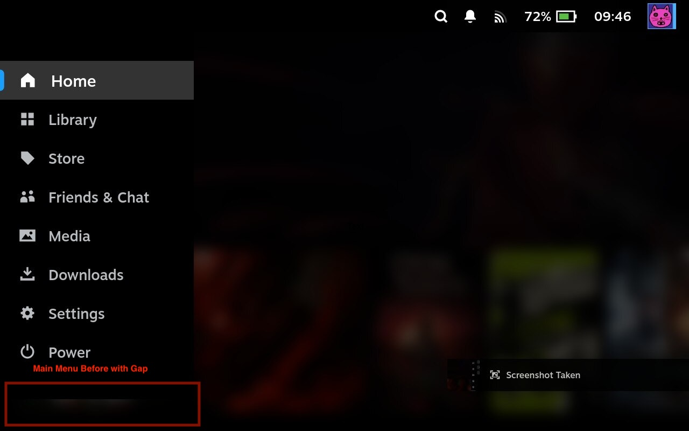
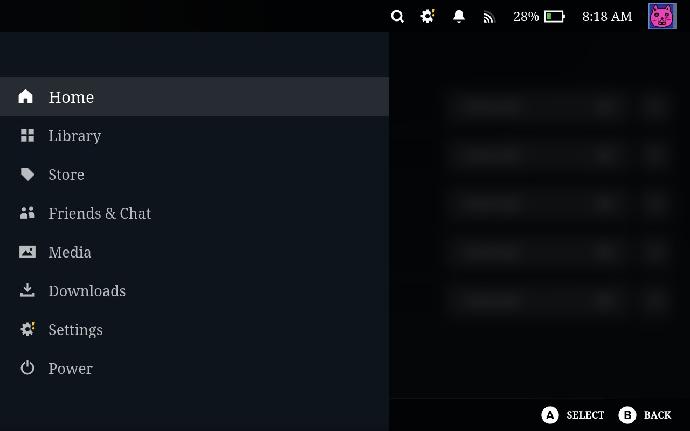
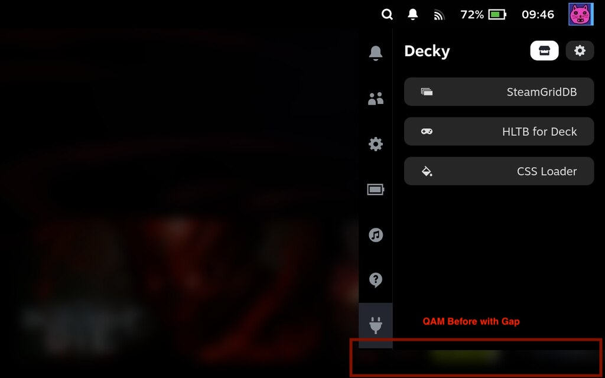
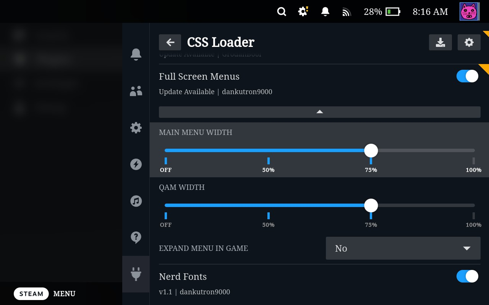
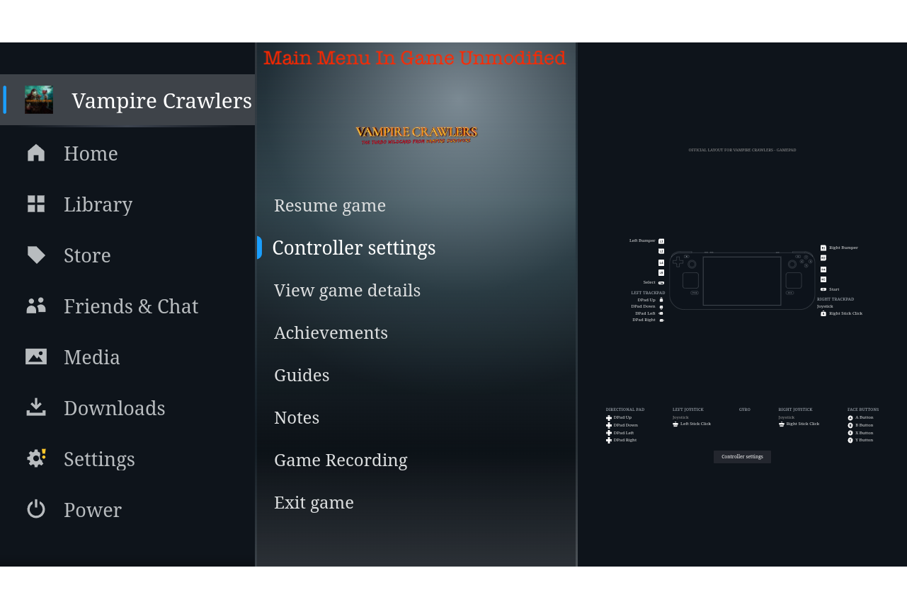
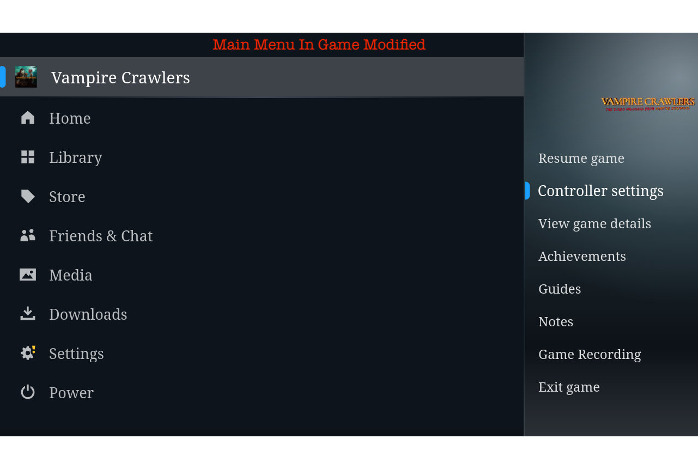

# Full Screen Menus

Extends the Quick Access Menu (QAM) and Main Menu to the bottom of the screen, and adds configurable width controls for both.

## Features

### Full-Height Menus

Both the Main Menu and QAM are extended to fill the full height of the screen instead of stopping partway down.

### Main Menu Width

Controls how wide the Main Menu is. Options: **Off** (default Steam width), **50%**, **75%**, **100%** of screen width.

### QAM Width

Controls how wide the Quick Access Menu is. Options: **Off** (default Steam width), **50%**, **75%**, **100%** of screen width.

### Expand Menu In Game

When a game is running, the Main Menu collapses to its default narrow width by default. Enable this to keep the menu at your configured width while in-game.

## Screenshots

### Main Menu

**Before**


**After**


### Quick Access Menu

**Before**


**After**


### Expand Menu In Game

**Off**


**On**


## Installation

### CSS Loader Store

Search for "Full Screen Menus" in the CSS Loader store and install it from there.

### Manual Install

**Prerequisites:** [Decky Loader](https://decky.xyz/) and [CSS Loader](https://docs.deckthemes.com/CSSLoader/Install/) must be installed.

1. Switch to Desktop Mode on your Steam Deck.
2. Download this repository as a ZIP (or clone it via `git clone`).
3. Copy the `Full-Screen-Menus` folder into `~/homebrew/themes/`:
   ```bash
   cp -r Full-Screen-Menus ~/homebrew/themes/
   ```
4. In Gaming Mode, open CSS Loader from the Quick Access Menu and reload your themes.
